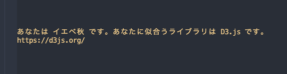

# 🌸🌞 pasona 🍁⛄️

どこでもパーソナルカラー診断ができる CLI ツール



## Install 💽

### パッケージマネージャー

#### MacOS

```
brew tap sadnessOjisan/pasona

brew install sadnessojisan/pasona/pasona
```

#### Windows

TBD

#### Linux

TBD

### バイナリインストール

| 環境    | URL                                                                                                   |
| ------- | ----------------------------------------------------------------------------------------------------- |
| MacOS   | https://github.com/sadnessOjisan/pasona/releases/latest/download/pasona-x86_64-apple-darwin.zip       |
| Windows | https://github.com/sadnessOjisan/pasona/releases/latest/download/pasona-x86_64-pc-windows-msvc.zip    |
| Linux   | https://github.com/sadnessOjisan/pasona/releases/latest/download/pasona-x86_64-unknown-linux-musl.zip |

### ソースからビルド

```sh

git clone git@github.com:sadnessOjisan/pasona.git

cd pasona

cargo run
```

## How to use 📖

```
pasona

> 肌の色に近い色は？
> 0: "イエロー系"
> 1: "ピンク系"
```

選択肢を数字で入力することで質問に回答できます。
全部に回答すると、診断結果が表示されます。
